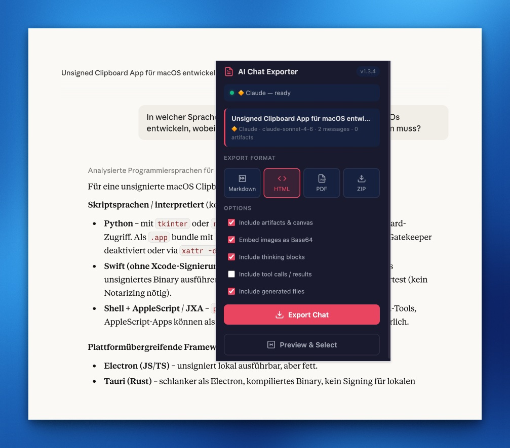
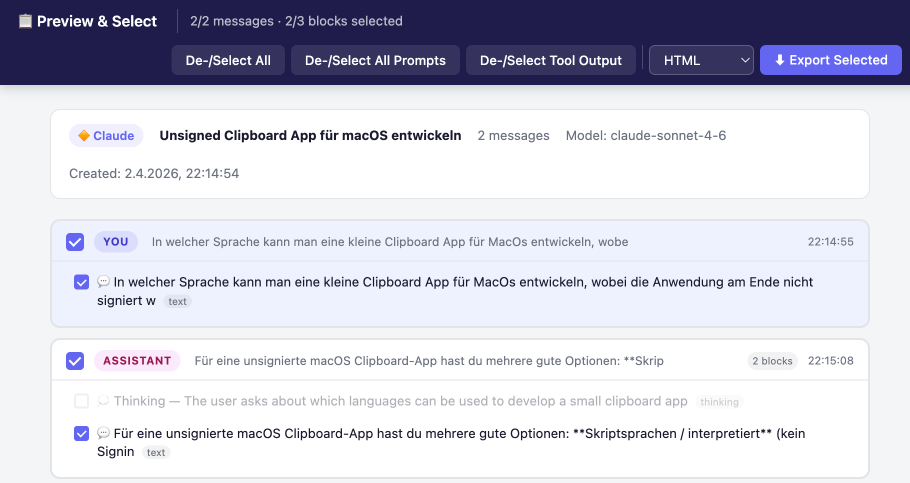

# AI Chat Exporter

> Deutsche Version: [README.de.md](README.de.md)

Browser extension for exporting conversations from **Claude**, **ChatGPT**, **Gemini**, and **Microsoft Copilot** — as complete, standalone files that work without an account, without the platform, and without an internet connection.

**Version:** 1.3.4 · **Browser:** Chrome, Edge

---

## Supported Platforms

| Platform | URL | Method | Notes |
|----------|-----|--------|-------|
| 🔶 **Claude** | claude.ai | API + DOM fallback | Full feature set incl. Artifacts, Thinking, Tool Calls |
| 🟢 **ChatGPT** | chatgpt.com | DOM scraping | Text, code, tables — no interactive widgets |
| 🔵 **Gemini** | gemini.google.com | DOM scraping | Text, code, tables |
| 🪟 **Microsoft Copilot** | m365.cloud.microsoft/chat | DOM scraping | Text, code, tables |



> **Note:** Feature coverage varies by platform. Claude uses the official API and delivers structured data including all block types. For ChatGPT, Gemini, and Copilot, content is read from the rendered DOM — meaning text and code are reliably exported, while platform-specific content like Artifacts or interactive elements is not available.

---

## Why this extension?

### No vendor lock-in when sharing

Shared chats are platform-bound and exclude many recipients:

- **ChatGPT Enterprise** — a shared chat is only accessible to recipients in the same company account.
- **Claude** — shared chats do not show Artifacts and visual content if the recipient has no Claude account.

The export works for **everyone** — as a simple HTML, ZIP, Markdown, or PDF file, without an account, without login, independent of the platform.

### Long-term archive

Chats containing important decisions, code reviews, analyses, or research are preserved as standalone files — regardless of whether the account still exists, the subscription expires, or the platform shuts down.

### Complete content

Not just text: Artifacts (interactive React apps, diagrams, SVGs), generated files, code blocks with syntax highlighting, and tables are fully exported and remain functional in the export.

### Four formats for every purpose

| Format | Ideal for |
|--------|-----------|
| **HTML** | Sharing with colleagues, embedding in documentation, fully offline |
| **ZIP** | All files and Artifacts individually accessible, ready to use |
| **Markdown** | Obsidian, Notion, Confluence, Git repositories |
| **PDF** | Formal documentation, meetings, archiving |

---

## Installation

### Chrome / Edge

1. Download the ZIP and **unpack** it
2. Open `chrome://extensions` (or `edge://extensions`)
3. Enable **Developer mode** (toggle in the top right)
4. Click **Load unpacked**
5. Select the unpacked `ai-chat-exporter` folder
6. The extension icon appears in the toolbar

> **Important:** The folder from which the extension was loaded must **not be moved or deleted**. Chrome loads the extension files directly from this directory — if it is removed, the extension will stop working and must be reinstalled.

> **After an update:** Click the reload icon on the extensions page so that new context menu entries and permissions take effect.

---

## Usage

### Option 1 — Toolbar icon

1. Open a chat on a supported platform
2. Click the extension icon in the toolbar
3. Choose a format: **HTML**, **ZIP**, **Markdown**, or **PDF**
4. Click **Export Chat** — or **Preview & Select** for selective export

### Option 2 — Right-click context menu

Right-click on the page → **"Chat exportieren"**:

- Export as HTML
- Export as Markdown
- Export as ZIP
- Export as PDF
- Preview & Select…

The export starts immediately — no popup needed.

### Option 3 — Preview & Select



Opens a dedicated tab with the full conversation view:

- **Checkboxes per message** and **per block** (text, code, artifact, image, thinking, tool output, etc.)
- Everything selected by default
- Quick selection buttons:
  - **Select All / Deselect All** — all messages and blocks
  - **Deselect All Prompts** — deselect only your own questions
  - **Deselect Tool Output** — deselect thinking, tool calls, web searches, etc.
- Choose format and click **Export Selected**

---

## Supported content by platform

| Content type | Claude | ChatGPT | Gemini | Copilot |
|--------------|:------:|:-------:|:------:|:-------:|
| Text with formatting | ✅ | ✅ | ✅ | ✅ |
| Code blocks | ✅ | ✅ | ✅ | ✅ |
| Tables | ✅ | ✅ | ✅ | ✅ |
| Artifacts (React, HTML, SVG) | ✅ interactive | — | — | — |
| Visualizer widgets | ✅ | — | — | — |
| Thinking blocks | ✅ | — | — | — |
| Tool calls / web search | ✅ optional | — | — | — |
| Embedded images | ✅ | — | — | — |
| Generated files | ✅ | — | — | — |
| Timestamps & metadata | ✅ | — | — | — |

*The limitations for ChatGPT, Gemini, and Copilot are technical: these platforms do not provide an accessible API for retrieving chat histories, so content is read from the rendered DOM.*

---

## Privacy

All processing happens **locally in the browser**. No data is sent to the developer, no analytics, no tracking.

### ChatGPT, Gemini, Microsoft Copilot

These platforms are scraped from the **already-rendered DOM** — no network requests are made by the extension. The content is read from what the browser has already loaded and is processed entirely in memory.

### Claude — what is sent during export

Claude uses its official API to deliver complete and structured export data (including Artifacts, Thinking blocks, and generated files). This requires the extension to make authenticated requests to `claude.ai` on your behalf.

**What is sent — and where:**

All requests go exclusively to `claude.ai`. No data leaves your browser to any other destination.

| Request | Endpoint | Purpose |
|---------|----------|---------|
| GET | `/api/organizations/{orgId}/chat_conversations/{id}?tree=True&rendering_mode=messages&render_all_tools=true` | Fetch the full conversation data |
| GET | `/api/bootstrap` or `/api/organizations` | Determine the organisation ID (only if not already known from an intercepted page request) |
| GET | `/api/share/{id}` | Fetch shared conversations (no authentication required) |
| GET | Image URL on `claude.ai` | Fetch embedded images as Base64 for self-contained exports (only when "Embed images" option is enabled) |

**What is sent with each request:**

The requests use the browser's existing session cookies for `claude.ai` — the same cookies that are sent with every normal page interaction. No additional credentials are read, stored, or forwarded by the extension.

**What happens to the data:**

```
claude.ai API  →  browser memory  →  local export file (HTML / ZIP / MD / PDF)
```

The conversation data is fetched into browser memory, converted into the export format, and written to a local file via the browser's download dialog. It is never uploaded, forwarded, or cached outside the current browser session. `chrome.storage.session` is used only to pass the data to the Preview & Select tab — it is automatically cleared when the browser is closed.

**What the extension does not do:**

- Does not read, store, or transmit your Claude API key or password
- Does not modify any conversations or send any write requests
- Does not collect usage data or statistics
- Does not load any external scripts or resources into the extension itself (CDN libraries are only referenced inside the sandboxed iframes of exported artifact files)

The extension activates only on the four supported domains and is completely inactive on all other sites.

---

## Architecture

```
ai-chat-exporter/
├── manifest.json              v1.3.4, permissions: activeTab, storage,
│                              downloads, scripting, tabs, contextMenus
├── background.js              Downloads, context menu, tab opening for PDF
├── popup.html / popup.js      UI, platform detection, export orchestration
├── popup.css
├── preview.html / preview.js  Preview & Select (chrome.storage.session)
│                              Supports ?autoexport=<format> for direct export
│                              from the context menu
│
├── platforms/
│   ├── claude/
│   │   ├── injector.js        Page context: fetch patch, org ID, auth API
│   │   └── content.js         Bridge + API normalisation + DOM fallback
│   ├── chatgpt/
│   │   └── content.js         DOM scraping (CodeMirror, tables as HTML sentinel)
│   ├── gemini/
│   │   └── content.js         DOM scraping (Angular: user-query, model-response)
│   └── copilot/
│       └── content.js         DOM scraping (Fluent UI: fai-UserMessage,
│                              fai-CopilotMessage, scriptor-component-code-block)
│
└── shared/
    ├── utils.js               escHtml, markdownToHtml, formatFileSize
    ├── widget-css.js          CSS variables + artifact/visualizer builder
    ├── html-template.js       Export HTML template with copy button, dark mode
    └── exporters/
        ├── html.js            HTML & PDF exporter
        ├── markdown.js        Markdown exporter
        └── zip.js             ZIP exporter (2-pass: artifacts, files, images)
```

---

## Adding a new platform

1. Create `platforms/<name>/content.js`
2. Add to `manifest.json` under `content_scripts` and `host_permissions`
3. Add to `background.js` → `SUPPORTED_URLS`
4. Add to `popup.js` → `detectPlatform()` and `platformLabel()`
5. Add badge mapping in `shared/exporters/html.js`

---

## License

Business Source License 1.1 — free for personal, non-commercial, and internal business use. Converts to Apache 2.0 on 2031-04-04. See [LICENSE.md](LICENSE.md) for details.
